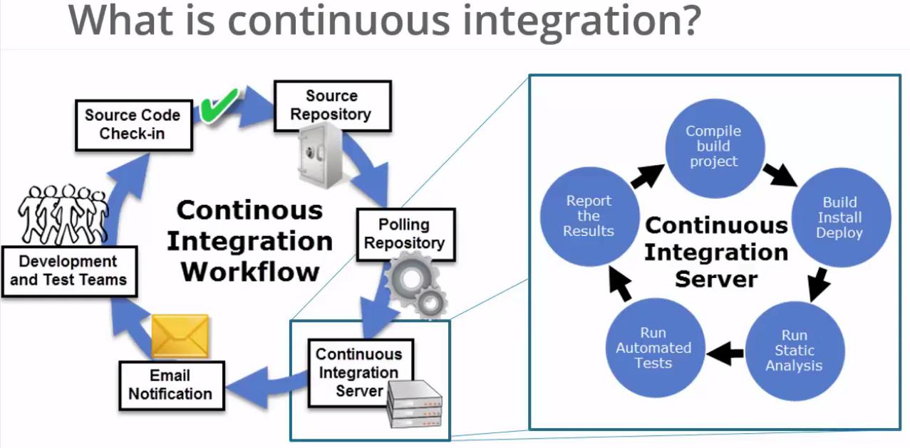
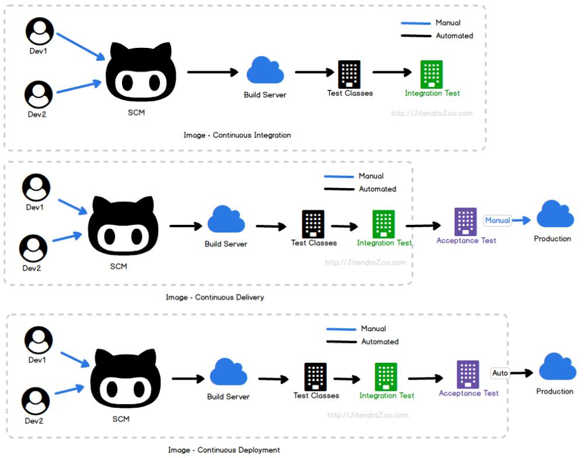
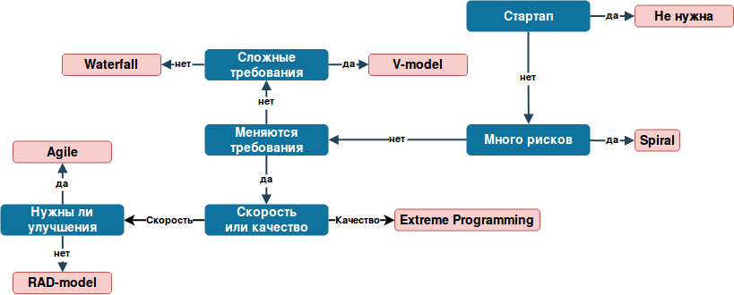

<center><font size=4>Технологии программирования</font></center>
<center><font size=3>Старичков Никита</font></center>

<div align="right"><font size=3>**Лекция №1**</font></div>
==

# <center><font color="#FF8C00">Компиляторы</font></center>

**Компиляция** - трансляция программы, составленной на исходном языке высокого уровня, в эквивалентную программу на низкоуровневом языке, близком машинному коду. Входной информацией для компилятора является описание алгоритма или программа, а на выходе - эквивалентное описание алгоритма на машинно-ориентированном языке

**1) Лексический анализ**
  - Разбор последовательности символов на распознанные сущности - лексемы, с последующим анализом и выдачей токенов
  - Оно же "токенизация", токен - название множества лексем
  - Одному токену может соотвествовать целое множество лексем

**2) Синтаксический анализ**
  - Генерация дерева синтаксического разбора
  - Внутренние вершины - операторы, Листья - операнды
  - Обход дерева Post-order алгоритмом

**3) Семантический анализ**
  - Проверка корректности

  `return return`

  - Статическая проверка типов

  `(int)a / (string)b`

  - Вывод типов (выражения наподобие *auto*)
  - Раскрытие "синтаксического сахара"

**4) Оптимизация**
  - Перестроение дерева для генерации более эффективного машинного кода

**5) Генерация кода**
  - Генерируется машинный код
  - На выходе - объектный файл
  - Машинный код - уже машиннозависимый, т.е. для каждой архитектуры/поколения процессоров/моделей может быть разным

<br/> <br/> <br/>

# <center><font color="#FF8C00">Методы отладки ПО</font></center>

**1) Воспроизведение дефекта**
  - Необходимо хранить все сборки, уходившие клиентам, и исходный код, из которого они были получены
  - Необходимо иметь инструменты логирования
    - Поддержание баланса между размером логов и их подробностью
    - Разные уровни логирования

**2) Анализ дефекта**
  - Рассмотреть не только сценарий от пользователя, а еще и другие вероятные сценарии
  - Проанализировать не только часть кода, но и код вокруг

**3) Дизайн исправления дефекта**
  - В отличие от исправления ошибки в коде исправление логической ошибки может быть в разы сложнее

**4) Исправление дефекта**
  - Исправление не должно привнести новых дефектов

<div align="right"><font size=3>**Лекция №2**</font></div>
==

**5) Валидация исправления**
  - Ревью кода членами команды
  - Ревью кода сторонними разработчиками (проверка качества кода, содержание уязвимостей)
  - Воспроизведение сценария дефекта
  - Запуск юнит-тестов для этой подсистемы
  - Запуск всех остальных тестов


**6) Интеграция исправления в код или целевую систему**
  - Разрешение конфликтов при мердже

**7) Дополнительные валидации после интеграции**
  - Запуск тестов в основной ветке

### <font color="#FF4500">1. Воспроизведение дефекта</font>

**1) Точное соответствие версии**

**2) Точное соответствие настроек**
  - Ведение логов настроек

**3) Получение данных, на которых наблюдается ошибка**
  - Логирование операций с данными (пользователь не всегда готов прислать данные)

**4) Точное воспроизведение действий пользователя/сценария**
  - Ведение логов сценариев

### <font color="#FF4500">2. Анализ дефекта</font>

**1) Root-cause (источник проблемы)**
  - Ошибки в коде, логические/технологические проблемы

**2) Условия возникновения**

**3) Область "повреждения"**

**4) Кто привнес?**
  - Возможно необходимо лучше покрыть подсистему тестами

**5) В какую версию?**

### <font color="#FF4500">3. Дизайн исправления дефекта</font>

**1) Технический**
  - Что поменять в коде?

**2) Архитектурный**
  - Что изменится в архитектуре системы и ее логике/поведении?

**3) Технологический**
  - Добавление новых технологических решений в систему или изменение старых

**4) Ревью и согласование**

### <font color="#FF4500">4. Изменение дефекта</font>

**1) Не привнести новые дефекты**

**2) "Ожидаемое" поведение и логика**
  - Повторять "ожидаемое" поведение системы в целом, которое не совсем корректно, или реализовать новую правильную логику, которая может конфликтовать с другими частями системы

**3) "Костыли" и "грязные хаки"**

**4) Документирование**

### <font color="#FF4500">5. Валидация исправления</font>

**1) Проверка исходного сценария**

**2) Проверка сценарием возникновения ошибки**

**3) Проверка связанных сценариев**

**4) Полноценное тестирование системы**

<br/> <br/>

### <font color="#FF4500">6. Интеграция исправления в код или целевую систему</font>

**1) Совмещение со "стволом"**

**2) Проверка сборки и работоспособности**

**3) Деплоинг новой версии в целевую систему**

**4) Обновление серверных/пользовательских приложений**

**5) Обновление документации!**

### <font color="#FF4500">7. Дополнительные валидации после интеграции</font>

**1) Проверка сценария возникновения ошибки**

**2) Проверка связанных сценариев**

**3) Полноценная проверка системы**

**4) Проверка устойчивости и работоспособности всех версий**

**5) Проверка корректности обновления**

<div align="right"><font size=3>**Лекция №3**</font></div>
==

# <center><font color="#FF8C00">Стандартные техники отладки ПО</font></center>

**1) Запуск программ в отладчики (трассировка)**
  - Софтверный
  - "Железный"
  - Удаленный дебагер

**2) Логирование**
  - Работы подсистемы
  - Программного кода

**3) Анализ кода без исполнения программы**
  - "Метод пристального взгляда"

**4) Анализ поведения системы**
  - Упрощения сценария
  - Ограничение объема данных
  - Упрощение данных/запроса

**5) Unit-тестирование**

**6) Прототипирование**
  - Создание упрощенного прототипа для отладки конкретного модуля

<br/>

**7) Отладка с помощью дампов**
  - Анализирование снимка памяти

**8) Отладка с помощью перехватов**
  - Можем отследить, когда вызывается определенная функция, и выполнить дополнительные действия, например, посмотреть аргументы, с которыми была вызвана функция

**9) Профилирование кода**
  - Можем, посмотреть как часто вызываются отдельные функции и сколько работают

**10) Выполнение кода в другой среде**

**11) Отладка методом RPC (remote procedure call)**
  - Удаленный вызов процедур

**12) Отладка путем анализа документации, проектных документов и т.д.**
  - Можно найти логические ошибки в архитектуре

**13) Отладка трансляцией кода**
  - "Трансляция вниз" (из высокоуровневого языка в низкоуровневый)
  - "Трансляция вверх"

**14) Отладка разработкой интерпретатора**

**15) Метод индукции (от частного к общему)**

**16) Метод дедукции (от общегок частному)**

**17) Обратное движение по алгоритму**

### <font color="#FF4500">Статический анализ кода</font>

**Статические анализаторы**

**1) Что умеют?**
  - Выявление ошибок в коде
  - Рекомендации по оформлению кода
  - Подсчет различных метрик исходного кода

**2) Преимущества**
  - Полное покрытие кода
  - Не зависит от используемого компилятора и среды разработки
  - Можно легко и быстро обнаруживать опечатки и прочее

**2) Слабости**
  - Трудности в выявлении ошибок в параллельном программировании и утечек памяти
  - Ложно-положительные срабатывания

<br/>

# <center><font color="#FF8C00">Критерии оценки архитектуры</font></center>

### <font color="#FF4500">Критерии хорошей архитектуры</font>

**1) Эффективность системы**
  - Надежность
  - Безопасность
  - Производительность
  - Масштабируемость

<div align="right"><font size=3>**Лекция №4**</font></div>
==

**2) Гибкость системы**
- Изменение текущего функционала
- Исправление ошибок

  Если даже простая ошибка требует больших изменений архитектуры, то такая система недостаточно гибкая

- Настройка системы
  - Под пользователей
  - Под разные задачи

**3) Расширяемость системы**
- Возможность добавлять новые сущности о функции
- *Внесение наиболее вероятных изменений должно требовать наименьших усилий*

  Обоснованный выбор того, что будет реализовано с возможностью расширения, а что будет "прибито гвоздями"

**4) Масштабируемость процесса разработки**
- Чем больше людей, тем меньше уходит времени на разработку
  ```
        t_old * p_old
        _____________

        t_new * p_new
  ```
  Чем коэффициент ближе к **1**, тем более масштабируем процесс разработки

**5) Тестируемость**
- Система должна быть тестируема

**6) Возможность повторного использования**
- Широкие возможности повторного использования в других проектах
- Части проекта друг от друга отделимы

**7) Сопровождаемость**
- Способность обеспечить хорошее сопровождение

### <font color="#FF4500">Критерии плохой архитектуры</font>

**1) Жескость**
- Тяжело изменить, настроить

**2) Хрупкость**
- Изменения нарушают другие модули
- Мало того, что тяжело настроить, так после этого что-нибудь еще и развалится

**3) Неподвижность**
- Тяжело извлечь модуль наружу (Идеальный модуль - черный ящик)

### <font color="#FF4500">High Cohesion + Low Coupling</font>

- **Hign Cohesion**
  - Высокая сопряженность внутри модуля
  - Модуль сфокусирован на одной задачи
- **Low Coupling**
  - Слабая связь между модулями
  - Модули независимы друг от друга, либо слабо связаны

### <font color="#FF4500">Закон Деметры (Law of Demeter)</font>

**Объект A не должен иметь возможность получить непосредственный доступ к объекту C, если у объекта A есть доступ к объекту B и у объекта B есть доступ к объекту C** (принцип минимального знания)

### <font color="#FF4500">Принципы **SOLID**</font>

- **Принцип единственной ответственности (The Single Responsibility Principle - SRP)**
  - Каждый должен иметь лишь одну ответственность и эта ответственность должна быть инкапсулирована в класс
  - Существует лишь одна причина (изменение функции), проводящая к изменению класса
  - Меняем класс только тогда, когда хотим изменить функцию, и меняем только его

- **Принцип открытости/закрытости (The Open Closed Principle - OCP)**
  - Программные сущности должны быть открыты для расширения, но закрыты для модификации
  - Изменения должны быть допустимы путем внесения новых сущностей, но внесение новых сущностей не должно вести к изменению кода, который эти сущности использует

- **Принцип подстановки Барбары Лисков (The Liskov Substitution Principle - LSP)**
  - Объекты в программе должны быть заменяемыми на экземпляры их подтипов без изменения правильности выполнения программы
  - Наследуемый класс должен дополнять, а не изменять базовый

- **Принцип разделения интерфейса (The Interface Segregation Principle - ISP)**
  - Много интерфейсов, специально предназначенных для клиентов, лучше, чем один интерфейс общего назначения
  - Например, лучше создать два отдельных интерфейса на работу с фото и видео, чем один общий

- **Принцип инверсии зависимостей (The Dependency Inversion Principle - DIP)**
  - Зависимость на Абстракциях, нет зависимости на что-то конкретное
  - Модули верхних уровней не должны зависеть от модулей нижних уровней
  - Абстракции не должны зависеть от деталей, детали должны зависеть от абстракций
  - Например, при наследовании зависимости могут возникать на уровне базовых классов, но классы-потомки не должны зависеть друг от друга или от базовых классов

<div align="right"><font size=3>**Лекция №5**</font></div>
==

# <center><font color="#FF8C00">Этапы проектирования</font></center>

### <font color="#FF4500">1. Формирование требований</font>

**1) Обследование объекта**

**2) Обоснование необходимости создания**

**3) Формирование требований пользователей**

**4)Подготовка отчетности по этапу**

**5) Общение с клиентом (заказчиком)**

**6) Общение с пользователем**

**7) Анализ прикладной области**

**8) Формирование оценок требуемой производительности/качества/...**

### <font color="#FF4500">2. Разработка концепции</font>
**1) Изучение объекта автоматизации**
  - Изучить объект очень детально
  - Формализовать все данные с предыдущих этапов

**2) Проведение необходимых НИР (научно-исследовательских работ)**
  - Понять можно ли вообще реализовать концепцию
  - Если можно то понять как это реализовать

**3) Разработка вариантов концепции системы**

**4) Подготовка отчетности по этапу**

**5) Выбор формата поставки**
  - Например, веб-страница, мобильное приложение, десктопное приложение

**6) Целевое оборудование**

**7) Построение высокоуровневой архитектуры системы**
  - Описание архитектуры системы на высоком уровне абстракции - описание модулей, из которых состоит система

**8) Выбор/разработка новых технологий/алгоритмов/...**
  - Обоснование выбора

### <font color="#FF4500">3. Техническое задание</font>

**Описание финальной, четкой формализации задания**

**1) Описание системы**
  - Описание концепции в целом

**2) Описание функциональности**
  - Более конкретное, детальное описание

**3) Описание требований**

**4) Описание сценариев использования**

**5) Условия сдачи**

### <font color="#FF4500">4. Эскизный проект</font>

**1) Разработка прототипов частей системы**

**2) Тестирование**

**3) Оценка качества и производительности**

**4) Изменение прототипов**

**5) Подготовка документации**

**6) Часто это просто MVP (minimum viable product)**
- Иногда это система с базовым функционалом
- Иногда - система с урезанными контентом
- Иногда - менее производительная

### <font color="#FF4500">5. Технический проект</font>

**1) Разработка частей системы**

**2) Разработка документации**

**3) Разработка заданий на проектирование смежных частей**

**4) Тестирование**

**5) Оценка качества и производительности**

### <font color="#FF4500">6. Рабочая документация</font>

**1) Сценарии использования**

**2) Описание логики работы**

**3) Описание производительности**

**4) Примеры использования**

**5) Обучающие материалы**

### <font color="#FF4500">7. Ввод в действие</font>

**1) Подготовка объекта автоматизации**

**2) Подготовка персонала**

**3) Комплектация системы поставляемыми изделиями**

**4) Проведение предварительных испытаний**

**5) Опытная эксплуатация**

**6) Приемочные испытания**

### <font color="#FF4500">8. Сопровождение системы</font>

**1) Гарантийные обязательства**

**2) Послегарантийное обслуживание**

<div align="right"><font size=3>**Лекция №6**</font></div>
==

# <center><font color="#FF8C00">Антипаттерны</font></center>

**1) В объектно-ориентированном программировании**
  - Связанны с особенностью проектирования

**2) В кодировании**
  - Как не нужно писать код

**3) Методологические**
  - Как не нужно организовывать работу

**4) Управления конфигурацией**

**5) Прочее**

<br/> <br/> <br/>

### <font color="#FF4500">Антипаттерны в ОПП</font>

**1) Базовый класс-утилита**
  - Наследование функциональности из класса-утилиты вместо делегирования ему
  - Т.е. вместо использования функциональности другого класса происходит наследование от него с последующим получением его функциональности

**2) Anemic Domain Problem**
  - Боязнь размещать логику в объектах предметной области
  - Например, если мы создаем класс, соответствующий реальной сущности, и выносим поля/методы соответствующие этому классу в другое место (например, потому что в реальной жизни этот реальный объект ими не обладает (файл сам себя не сохраняет, дата производства колеса на колесе не пишется))
  - Т.е. когда при разработке программной модели, соответствующей реальной предметной области, появляются методы/поля характерные только программной реализации, но которых нет в реальном мире, происходит разделение на разные классы

**3) Вызов предка**
  - Для реализации функциональности методу потомка приходится вызывать те же методы родителя
  - Возможным решением является добавление новых виртуальных методов

**4) Ошибка пустого подкласса**
  - Когда класс обладает различным поведением по сравнению с классом, который наследуется от него без изменений
  - Т.е. при наследовании без изменений новый объект перестает работать так же, как и исходный класс
  - В **SOLID** говорится только о корректности работы, а здесь говорится о том, что должно работать точно так же

**5) Божественный объект**
  - Концентрация функциональности в одном классе/модуле/системе

**6) Объектная клоака**
  - Переиспользование объектов, находящихся в непригодном для переиспользования состоянии
  - Перед переиспользованием объекта должен произойти процесс подготовки к повторному использованию

**7) Полтергейст**
  - Объекты, чье единственное предназначение – передавать данные другим объектам
  - Т.е. создание объекта *C* для связи между **конкретными** объектами *A*, *B*, который сам по себе больше ничего не делает
  - Важно, что объекты обеспечивающие связь в общем случае, под этот антипаттерн не попадают

**8) Проблема йо-йо**
  - Чрезмерная размытость сильно связанного кода по иерархии классов
  - Например, в одном месте в коде происходят вызовы функций из разных уровней иерархии

**9) Одиночество**
  - Неуместное использование паттерна синглтон

**10) Приватизация**
  - Сокрытие функциональности в приватной части, что затрудняет расширение в наследниках

**11) Френд-зона**
  - Неуместное использование дружественных классов и функций

**12) Каша из интерфейсов**
  - Объединение нескольких интерфейсов, предварительно разделенных, в один

**13) Висящие концы**
  - Интерфейс, большинство методов которого бессмысленные и являются "пустышками"
  - Например, в базовом классе объявлены методы, которые в некоторых классах-наследниках так никогда и не будут реализованы

**14) Заглушка**
  - Попытка "натянуть" на объект уже имеющийся малоподходящий по смыслу интерфейс, вместо создания нового

### <font color="#FF4500">Антипаттерны в кодировании</font>

**1) Ненужная сложность**
  - Внесение ненужной сложности в решение

**2) Действие на расстоянии**
  - Взаимодействие между широко разнесенными частями системы

**3) Накопить и запустить**
  - Установка параметров подпрограмм в глобальных переменных
  - Более правильным решением является последовательный запуск подпрограмм, так код получается более понятный, изменяемый
  - Кроме того в процессе исполнения подпрограмм данные могли измениться, или что-то могло сломаться раньше, чем потребовались какие-то полученные данные

**4) Слепая вера**
  - Недостаточная проверка корректности и полноты исправления ошибки или результата работы

**5) Лодочный якорь**
  - Сохранение неиспользуемой части программы

**6) Активное ожидание**
  - Потребление ресурсов в процессе ожидания запроса, путем выполнения проверок, чтений файлов и т.д., вместо асинхронного программирования

**7) Кэширование ошибки**
  - Несбрасывание флага ошибки после ее обработки

**8) Воняющий подгузник**
  - Сброс флага ошибки без ее обработки или передачи на уровень выше

<br/>

**9) Проверка типа вместо интерфейса**
  - Проверка на специфический тип, вместо требуемого определенного интерфейса

**10) Инерация кода**
  - Избыточное ограничение системы из-за подрузамевания постоянной ее работы в других частях системы

**11) Кодирование путем исключения**
  - Добавление нового кода для каждого нового особого случая

**12) Таинственный код**
  - Использование аббревиатур/сокращений вместо логичных имен

**13) Жесткое кодирование**
  - Внедрение предположений в слишком большое количество точек в системе

**14) Мягкое кодирование**
  - Настраивается вообще все, что усложняет конфигурирование

**15) Поток лавы**
  - Сохранение нежелательного (например, содержащего уязвимости) кода из-за боязни последствий его удаления/исправления

**17) Волшебные числа**
  - Использование числовых констант без объяснения их смысла

**18) Процедурный код**
  - Когда стоило отказаться от ООП...
  - Например, весь код состоит из вложенных вызовов статических функций

<div align="right"><font size=3>**Лекция №7 (доп. лекция)**</font></div>
==

**19) Спагетти-код**
  - Код с чрезмерно запутанным порядком выполнения

**20) Лазанья-код**
  - Использование неоправданно большого числа уровней абстракции

**21) Равиоли-код**
  - Объекты настолько склеены между собой, что невозможно провести рефакторинг

**22) Мыльный пузырь**
  - Объект, инициализированный мусором (не инициализированный), слишком долго ведет себя как корректный

**23) Мьютексный ад**
  - Внедрение слишком большого количества примитивов синхронизации в код

**24) (Мета-)шаблонный рак**
  - Неадекватное использование шаблонов везде, где только получилось, а не где нужно

### <font color="#FF4500">Методологические антипаттерны</font>

**1) Использование паттернов**
  - Значит, имеется недостаточный уровень абстракции

**2) Копирование-вставка**
  - Нужно было делать более общий код

**3) Дефакторинг**
  - Процесс уничтожения функциональности и замены ее документацией

**4) Золотой молоток**
  - Использование любимого решения везде, где только получилось
  - Например, писать быструю сортировку, чатик, сайт, мобильное приложение на *C++*

**5) Фактор невероятности**
  - Гипотеза о том, что известная ошибка не проявится

**6) Преждевременная оптимизация**
  - Оптимизация при недостаточной информации

**8) Метод подбора**
  - Софт разрабатывается путем небольших изменений

**9) Изобретение велосипеда**
  - Создание с нуля того, для чего есть готовое решение

**10) Изобретение квадратного колеса**
  - Создание плохого решения, когда уже есть хорошее готовое

**11) Самоуничтожение**
  - Мелкая ошибка проводит к фатальной

**12) Два тоннеля**
  - Вынесение нового функционала в отдельное приложение

**13) Коммит-убийца**
  - Внесение изменений без проверки влияния на другие части программы

<br/> <br/> <br/> <br/>

### <font color="#FF4500">Антипаттерны управления конфигурацией</font>

**1) Ад зависимостей** *(DLL-hell в Windows)*
  - Разрастание зависимостей до уровня, что раздельная установка/удаление программ становится если не невозможным, то крайне сложные

### <font color="#FF4500">Прочее</font>

**1) Дым и зеркала**
  - Демонстрация того, как будут работать ненаписанные функции

**2) Раздувание ПО**
  - Разрешение последующим версиям использовать все больше и больше ресурсов

**3) Функции для галочки**
  - Превращение программы в "сборную солянку" плохо работающих и не связанных между собой функций (функциональностей)

<div align="right"><font size=3>**Лекция №8**</font></div>
==

# <center><font color="#FF8C00">Continuous Integration</font></center>

**Continuous Integration** — практика разработки программного обеспечения, которая заключается в постоянном слиянии рабочих копий в общую основную ветвь разработки (до нескольких раз в день) и выполнении частых автоматизированных сборок проекта для скорейшего выявления потенциальных дефектов и решения интеграционных проблем.


- Появляется необходимость проводить тестирование под разными системами.
- Удобнее, чтобы тесты прогонялись автоматически на другой машинке.
- Т.е. при определенных условиях (например, коммит) срабатывает триггер, который запускает сборку проекта и запуск тестов, а после присылает отчет.




- При **continuous delivery** непрерывно появляются новые версии, которые можно отдать клиенту.
- При **continuous deployment** поставка продукта идет автоматически, а не ручным способом.
  - Подходит для очень интенсивной внутренней разработки.
  - На продакшн сервер так не стоит делать.

Первый вариант более консервативный, второй более агрессивный.

Разные подходы для разной длины цикла разработки.

<div align="right"><font size=3>**Лекция №9**</font></div>
==

# <center><font color="#FF8C00">Методологии разработки ПО</font></center>

**Методологии разработки ПО** - набор методов, подходов, используемых при работе с данным проектом.

**Проект** - временное предприятие, направленное на создание уникального продукта, услуги или получения уникального результата.

Проект оперирует некоторыми ресурсами - деньги, время, человеческий ресурс.

<br/>

### <font color="#FF4500">Факторы выбора методологии разработки</font>

**1) Специфика проекта**
  - Задача
  - Область
  - Требования
  - Клиенты
  - Заказчик

**2) Система финансирования**

**3) Вариант поставки**

### <font color="#FF4500">Общий подход к созданию проекта</font>

**1) Проектирование (анализ требований, анализ бизнес-требований)**

**2) Дизайн архитектуры, анализ функциональных требований**

**3) Кодирование**

**4) Тестирование**

**4.5) Внедрение или поддержка**

# <center><font color="#FF8C00">Модели разработки</font></center>

### <font color="#FF4500">1. Модель водопада (waterfall)</font>

**Каскадная модель (все пункты друг за другом).**

**1) Заранее все планируется до мелочей, после чего идет "спуск"**
- Если что-то не так распланировали -> проиграли
- Если что-то в процессе изменилось -> проиграли
- Четкие сроки, стоимость, результат

**2) Полное прохождение стадий друг за другом**

**3) Следующая стадия не начинается, пока не закончена предыдущая**

**4) Никаких повторений, вторых шансов, внесений правок в предыдущие этапы**

**5) Когда можно использовать?**
- Требования к проекту полностью известны и понятны, и не будут изменяться в ходе работы
- Доступно достаточное количество квалифицированных специалистов
- Скорее для небольшого проекта

<br/> <br/> <br/> <br/>

### <font color="#FF4500">2. V-модель</font>

**Каскадная модель (все пункты друг за другом).**

### <font color="#166ac9">*V - Верификация* (проверка начальных параметров)</font>

**1) Требования бизнеса / 1. концепция**
- От заказчика

**2) Функциональные требования / 2. высокоуровневая архитектура**
- Расписывание функций

**3) Архитектура / 3. детальное проектирование**
- Расписывание модулей

**4) Реализация**
- Расписывание, например, алгоритмов

**5) (общий пункт) Код**

### <font color="#166ac9">*V - Валидация* (проверка на соответствие результата)</font>

**1) Приемо-сдаточное тестирование / 1. поставка и поддержка**
- Показ заказчику, что все требования от продукта выполняются

**2) Функциональное тестирование / 2. тестирование и проверка**
- Проверка, что приложение реально может собраться

**3) Интеграционное тестирование / 2. тестирование и проверка**
- Тестирование модулей вместе

**4) Модульное тестирование / 3.**
- Тестирование модулей по отдельности

**5) (общий пункт) Код**

- Требования идут сверху вниз, а разработка идет снизу вверх.

**5) Когда используется?**
- У заказчика много ресурсов
- У вас много ресурсов
- Заказчику нужно безотказное приложение (поэтому так много тестирования)
- Например, медицинские или гос. сервисы

### <font color="#FF4500">3. Инкрементная модель</font>

**1) Первая версия: базовый функционал**

**2) Далее добавляются дополнительные возможности**

**3) Каждая версия работает, каждая последующая версия обладает большим функционалом**

**4) Т.е. функционал реализуется последовательно, но сразу на необходимом уровне**

**5) Особенности:**
- Основные требования определены изначально, а детали могут дорабатываться в процессе разработки
- Рано можно вывести на рынок
- Удобно добавить в основное приложение некоторую, возможно, рисковую затратную фичу.

### <font color="#FF4500">4. Итерационная модель</font>

**1) Каждый этап – база для определения дальнейших требований**

**2) Ключевой момент – каждая новая версия полностью работоспособна**

**3) Требования к следующей версии составляются на основе анализа использования текущей**

**4) Т.е. реализуется весь функционал сразу, но на слабом уровне, а далее улучшается качество**

**5) Особенности:**
- Основные требования определены изначально, а детали могут дорабатываться в процессе разработки
- Имеет место эволюция деталей, модулей
- Подходит для больших проектов

***В двух последних моделях после этапа тестирования идет этап оценки результата. А затем либо снова проектирование, либо релиз, либо закрытие проекта***

### <font color="#FF4500">5. RAD Model</font>

***Rapid Application Development Model***

**1) В наличии есть большое количество ресурсов, а времени очень мало**

**2) Различные модули разрабатываются различными командами**

**3) Использование инструментов автоматической сборки и генерации кода**

**4) Этапы (возможно зациклены):**
- Бизнес-моделирование
- Анализ и создание модели данных
- Анализ и создание модели процесса
- Автоматическая сборка приложения
- Тестирование

### <font color="#FF4500">6. Спиральная модель</font>

**1) Этапы (зациклены):**
- Планирование
- Анализ рисков
- Конструирование (кодирование)
- Оценка результатов

**2) Плюсы:**
- гибкость - возможность внесения изменений и добавления новой функциональности даже на относительно поздних этапах
- раннее создание рабочих прототипов

**3) Минусы:**
- может быть достаточно дорогой в использовании
- управление рисками требует привлечения высококлассных специалистов
- успех процесса в большой степени зависит от стадии анализа рисков
- не подходит для небольших проектов

**4) Особенности**
- На каждой итерации улучшается качество продукта.
- Ориентация на результат, а не продукт

**4) Примеры**
- Чат-бот

### <font color="#FF4500">7. Agile</font>

***Гибкая методология разработки***

**1) Процесс разработки разделен на итерации**

**2) Результат можно оценивать после каждой итерации**

**3) Проект должен очень хорошо масштабироваться, чтобы можно было выделить таски**

**4) Scrum (краткие ежедневные встречи)**
- Оценить текущие результаты
- Обсудить проблемы
- Принять тактические решения

**5) Sprint (периодические встречи)**
- Направление развития / стратегические решения
- Определение и распределение задач на следующий спринт
- Обсуждение итогов предыдущего спринта

**6) Этапы:**



